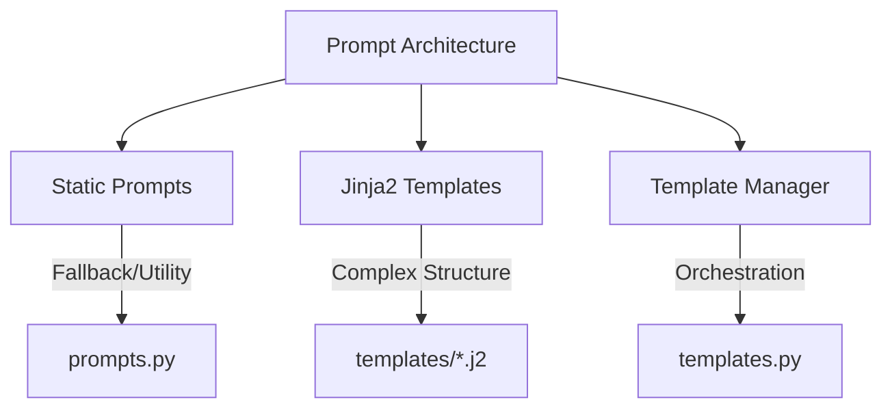
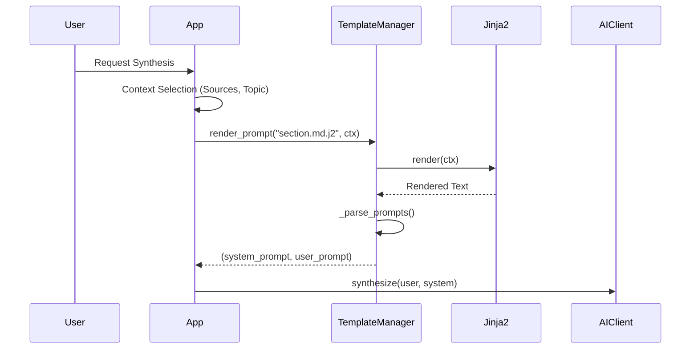

# NeuroSynth Prompt System Architecture

## Overview
NeuroSynth uses a layered prompt system with three distinct components designed to separate logic (Python), structure (Templates), and orchestrators (Managers).



## 1. Static Prompts (`src/neurosynth/synthesis/prompts.py`)
Simple Python f-strings used for utility tasks, re-ranking fallback, and specific sub-tasks where complex logic is not required.

**Key Examples:**
- `SECTION_ENHANCEMENT_PROMPT`: For enriching existing content.
- `SUBSECTION_GENERATION_PROMPT`: For breaking down large sections.
- `SECTION_SYNTHESIS_[DESCRIPTIVE|IMPERATIVE]`: Fallback prompts for tone-specific synthesis without full template context.

```python
SECTION_ENHANCEMENT_PROMPT = """Enhance this section with additional detail...
Current content:
{content}
...
"""
```

## 2. Jinja2 Templates (`src/neurosynth/templates/`)
The core of the synthesis engine. These templates allow for:
- **Conditional Logic**: Changing tone/structure based on section type.
- **Loops**: Iterating over sources or image lists.
- **Filters**: Custom regex searching or data formatting.

### Directory Structure
```text
src/neurosynth/templates/
├── synthesis/
│   ├── section.md.j2      ← Core section synthesis (Legacy & Async)
│   ├── anatomy.md.j2      ← Anatomy-specific with layer progression
│   ├── disorder.md.j2     ← Pathology chapters (4-part structure)
│   ├── procedure.md.j2    ← Surgical technique with step format
│   ├── encyclopedia.md.j2 ← Full chapter synthesis
│   ├── outline.md.j2      ← Chapter outline generation
│   └── imaging.md.j2      ← Radiology-focused sections
├── study/
│   ├── oral_examiner.md.j2   ← FRCSC/ABNS oral board simulation
│   ├── mcq_generator.md.j2   ← Board-style MCQ generation
│   └── audio_script.md.j2    ← Podcast-style audio content
└── macros/
    └── callout_boxes.j2      ← Reusable ⚠️ HAZARD / 💡 PEARL boxes
```

### Template Anatomy: `---SYSTEM---` / `---USER---` Markers
Templates are split into System and User prompts using special markers. This allows strict separation of instructions vs. data.

**Example (`synthesis/section.md.j2`):**
```jinja2
{# Template header with expected context variables #}
---SYSTEM---
You are an expert neurosurgical knowledge synthesizer.


WRITING STYLE: IMPERATIVE/PRESCRIPTIVE
Write in an active, direct voice suitable for surgical instruction...

WRITING STYLE: DESCRIPTIVE/ACADEMIC
Write in a scholarly, academic voice...


---USER---
# Section Synthesis Request

| Parameter | Value |
|-----------|-------|
| **Section Title** | {{ ctx.section_title }} |
...
```

## 3. Template Manager (`src/templates.py`)
The `TemplateManager` class handles loading, rendering, and parsing templates.

**Key Responsibilities:**
1. **Loading**: Initializes Jinja2 environment with `src/neurosynth/templates` as root.
2. **Rendering**: Applies `context` dictionary to the template.
3. **Parsing**: Splits the result into `system_prompt` and `user_prompt` based on markers.

```python
def render_prompt(self, template_name: str, context: Dict[str, Any]) -> Tuple[str, str]:
    # ... renders template ...
    return self._parse_prompts(rendered)
```

## 4. Context Variables Pattern
Templates rely on a standardized `ctx` object passed from the synthesis engine.

| Template | Key Context Variables |
|----------|----------------------|
| `section.md.j2` | `ctx.section_title`, `ctx.section_type`, `ctx.sources`, `ctx.figures`, `ctx.word_target` |
| `oral_examiner.md.j2` | `ctx.exam_context`, `ctx.history`, `ctx.case_type`, `ctx.difficulty`, `ctx.focus_topics` |
| `mcq_generator.md.j2` | `ctx.topic`, `ctx.exam_context`, `ctx.num_questions`, `ctx.difficulty`, `ctx.question_style` |
| `audio_script.md.j2` | `ctx.content`, `ctx.duration`, `ctx.format`, `ctx.host_style`, `ctx.target_audience` |

## 5. Conditional Logic in Templates
Templates adapt the prompt based on metadata, ensuring the LLM receives the most relevant instructions.

| Condition | Result |
|-----------|--------|
| `section_type == 'IMPERATIVE'` | Surgical instruction voice, step format, active verbs. |
| `section_type == 'DESCRIPTIVE'` | Academic prose, evidence hierarchy, passive voice where appropriate. |
| `section_title` contains `'anatomy'` | Enforces layer progression (Skin → Bone → Dura) and measurement tables. |
| `section_title` contains `'surgical'` | Enforces step format with specific headers (ENDPOINT, ANATOMY AT RISK). |
| `difficulty == 'malignant'` (oral) | Activates "Hostile Examiner" persona for stress testing candidates. |

## 6. Prompt Flow
How a user request transforms into an LLM call:



## 7. Key Features
### 7.1 Figure Integration Protocol
Built directly into the prompts to ensure multimodal output.
- **Reference**: `[FIGURE: <id>]` placeholders inserted at the end of sentences.
- **Density**: Calculated strictly based on word count (e.g., 1 figure per 300 words).
- **Source Truth**: LLM is explicitly forbidden from inventing figure IDs; must use provided list.

### 7.2 Conflict Handling
Templates instruct the LLM on how to manage divergent information from sources:
- **Quantitative**: Present ranges (e.g., "2-5% mortality").
- **Contradictory**: Explicitly state the conflict ("Author A reports sensitive, while Author B reports resistant").
- **Attribution**: Use `source_id` to attribute specific claims when they differ.
